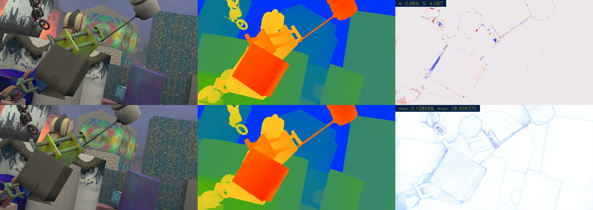
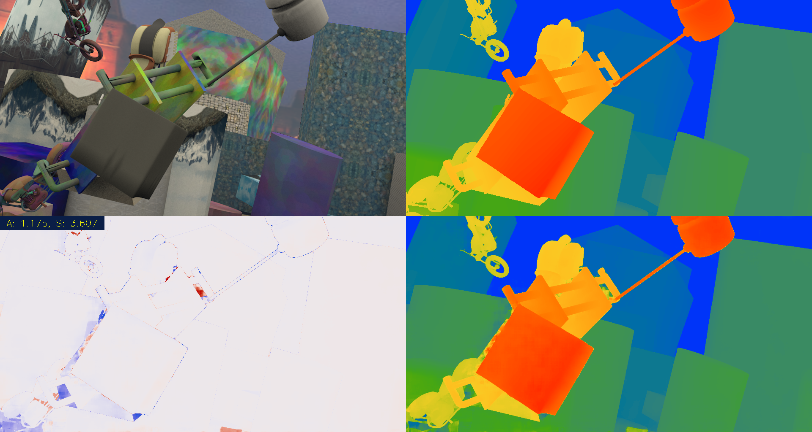

# Tutorial2020_Stereo: The Exercises on Recent Deep-Learning Stereo Vision Models. Prepared for the Summer School 2020 at the [airlab][airlabss] in Carnegie Mellon University

[airlabss]: https://theairlab.org/summer2020

This repository contains the exercise code for the course of __Recent Advances of Binocular Stereo Vision__ held by the [airlab][airlabss] in Carnegie Mellon University as a part of the Summer School 2020. 

The course covers both recent non-learning and learning based methods. This repository contains the learning-based models discussed in the lecture. The non-learning part can be found [here](https://github.com/huyaoyu/Tutorial2020_Stereo_ROS).

# Models

This exersice code presents two popular deep-learning structures for passive binocular stereo vision, namely, the 3D cost volume structure [[1]](#PSMNet) and the cross-correlation structure [[2]](#PWCNet)(although [[2]](#PWCNet) is for optical flow).

## 3D cost volume

The backbone comes from the PSMNet[[1]](#PSMNet). The origina PSMNet is modified such that it also estimates the uncertainty of its own disparity prediction. This modified model is called PSMNU. Please refer to [[3]](#PSMNU) for more details about PSMNU. 

## Cross-correlation

The implementaion of the cross-correlation is mainly from the PWC-Net [[2]](#PWCNet) which does optical flow estimation. The model provided here is modified to match the current PyTorch version 1.5. Cross-correlation is only performed along the x-axis since we only care about the disparity not the optical flow.

## Pre-trained models

Pre-trained models can be found in [here](https://drive.google.com/drive/folders/1y0iGPGRdhwhW0lnLap4zJC15RuUkmk0b?usp=sharing).

Please note that there ara two models for each type of structure. For a single structure, the two pre-trained models deal with RGB and grayscale images, respectively. All models are trained on the Scene Flow datasets (with Flyingthings3D and Monkaa but not the driving scenes) [[4]](#SceneFlow). For the models that have a 3D cost volume, maximum disparity is 256 pixel. The models having cross-correlation are trained with a maximum disparity range of 128 pixels. 

Pre-trained models are provided here for exercice, not for benchmarking, since the overall performance is not optimized.

## System requirements

A GPU is required to run the exercises.

These code and pre-trained models are tested on Ubuntu 18.04 LTS with Python 3.6.9, CUDA 10, and PyTorch 1.0+, TorchVision.

Use the following command to install the required python packages to the current python environment (Not including PyTorch and TorchVision). 

```python
pip3 install opencv-python numba colorcet plyfile
```

# Tutorial Video

Coming soon, stay tuned.

# Exercises
## Sample input data

The sample input data are saved at [/SampleData](/SampleData) sub-directory. 

## 3D cost volume exercise
In thise exercise, we will use the pre-trained models which implementing the 3D cost volume to perform disparity estimation. The steps are very simple.

1. Create a new sub-folder /PSMNU/Pretrained and place the pre-trained models in the newly created folder.
2. Go to directory /PSMNU.
3. Run `python3 LocalTest.py`.

`LocalTest.py` reads the content in `/PSMNU/Cases.json`. Individual case can be disabled by setting the `"enable"` key to `"flase"`.

If everything works smoothly, a bunch of results will be produced. For sample case that have ground truth data, an error map will be drawn alongside the disparity prediction.



The models also predict the per-pixel uncertainty of its disparity prediction. The uncertainty is shown in the above image at the lower right corner. The colormaps used in the above image can be found [here](https://colorcet.holoviz.org/user_guide/Continuous.html), specifically, `rainbow` for disparity, `coolwarm` for disparity error compared with the ground truth, and `CET_L19` for uncertainty. 

If the ground truth disparity is not available, then the result will look like the following iamge.



If the camera parameters (intrinsic and extrinsic paramters) are known for a sample case, the reconstructed 3D point cloud will be generated as a PLY file.

## Cross-correlation exercise

The cross-correlation layer has to be compiled and installed to the python environment before testing the pre-trained models. Steps aftet the installation are pretty much the same with the 3D cost volumne exercise.

1. Go to /Correlation/CorrelationCUDA.
2. Run `python3 setup.py build_ext`. Wait for the compilation process.
3. Run `python3 setup.py install --record InstalledFiles.txt`. The cross-correlation layer will be installed to the current python environment. E.g, if you are using a virtual environment, the intallation destination will be the correct location specified by the virtual environment. The `--record` command records the installed files during the installation. If you would like to remove the installed cross-correlation layer, use `cat InstalledFiles.txt | xargs rm -f`.
4. Create a new sub-folder /Correlation/Pretrained and place in the pre-trained models.
5. Go to /Correlation.
6. Run `python3 LocalTest.py`.

Similar to 3D cost volume exercise, `LocalTest.py` reads in `Cases.json` file and process all the enabled cases. Disparity error map and 3D point cloud will be generated if associated ground truth data or camera parameters are available. The color maps are the same with the PSMNU exercise.

# References
<a id="PSMNet">[1]</a> Chang, Jia-Ren, and Yong-Sheng Chen. "Pyramid stereo matching network." In Proceedings of the IEEE Conference on Computer Vision and Pattern Recognition, pp. 5410-5418. 2018.

<a id="PWCNet">[2]</a> Sun, Deqing, Xiaodong Yang, Ming-Yu Liu, and Jan Kautz. "Pwc-net: Cnns for optical flow using pyramid, warping, and cost volume." In Proceedings of the IEEE conference on computer vision and pattern recognition, pp. 8934-8943. 2018.

<a id="PSMNU">[3]</a> Y. Hu, W. Zhen, and S. Scherer, “Deep-Learning Assisted High-Resolution Binocular Stereo Depth Reconstruction,” presented at the 2020 IEEE International Conference on Robotics and Automation (ICRA), 2019.

<a id="SceneFlow">[4]</a> Mayer, Nikolaus, Eddy Ilg, Philip Hausser, Philipp Fischer, Daniel Cremers, Alexey Dosovitskiy, and Thomas Brox. "A large dataset to train convolutional networks for disparity, optical flow, and scene flow estimation." In Proceedings of the IEEE conference on computer vision and pattern recognition, pp. 4040-4048. 2016.
