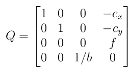

# Sample stereo images.

For the exersices, here we prepared several test cases from various sources including public datasets and our customized stereo setup. Here is a summary.

|       Sub-directory      |                                                 Origin                                                 |          True data         |  Camera params |
|:------------------------:|:------------------------------------------------------------------------------------------------------:|:--------------------------:|:--------------:|
| KITTI                    | KITTI stereo dataset http://www.cvlibs.net/datasets/kitti/                                             | Sparse                     | Yes            |
| Middlebury_E3            | Middlebury Evaluation V3 https://vision.middlebury.edu/stereo/eval3/                                   | Disparity + occlusion mask | Yes            |
| SceneFlow_Flyingthings3D | Scene Flow dataset https://lmb.informatik.uni-freiburg.de/resources/datasets/SceneFlowDatasets.en.html | Disparity                  | Yes, simulated |
| Shimizu                  | A pair of stereo image come from our customized stereo camera setup.                                   | No                         | Yes            |
| TartanAir                | TartanAir SLAM dataset https://www.aicrowd.com/challenges/tartanair-visual-slam-stereo-track           | Disparity                  | Yes, simulated |

Camera parameters are saved in `Q.dat` files in the sub-directories, if there is one. The content of a `Q.dat` file is the same as that described by the OpenCV calib3d documentation for stereo rectification ([stereoRectify()](https://docs.opencv.org/2.4/modules/calib3d/doc/camera_calibration_and_3d_reconstruction.html#void%20stereoRectify(InputArray%20cameraMatrix1,%20InputArray%20distCoeffs1,%20InputArray%20cameraMatrix2,%20InputArray%20distCoeffs2,%20Size%20imageSize,%20InputArray%20R,%20InputArray%20T,%20OutputArray%20R1,%20OutputArray%20R2,%20OutputArray%20P1,%20OutputArray%20P2,%20OutputArray%20Q,%20int%20flags,%20double%20alpha,%20Size%20newImageSize,%20Rect*%20validPixROI1,%20Rect*%20validPixROI2))). Thus, `Q.data` represents a 4x4 matrix.

where `cx` anc `cy` are the principle point and `f` is the focal length. `b` is the baseline of the stereo camera setup. `cx`, `cy`, and `f` are all measured in pixels and `b` is in metric unit. Some simulated datasets use imaginary camera parameters where `b` will have non-metric unit.
